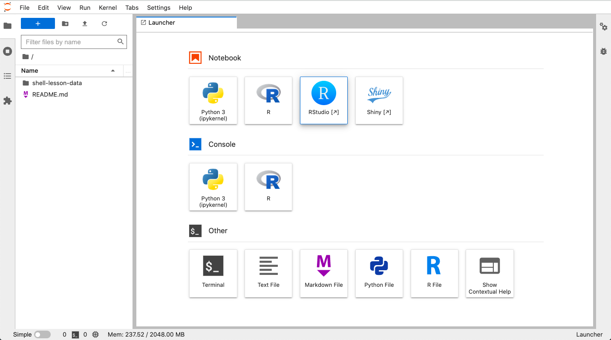
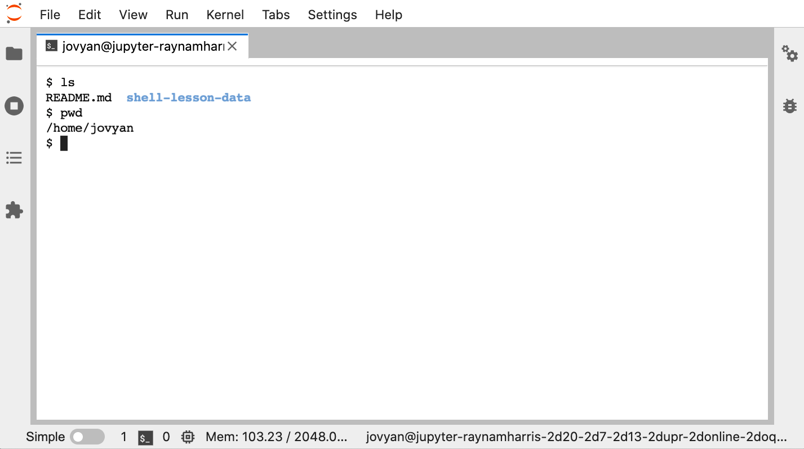
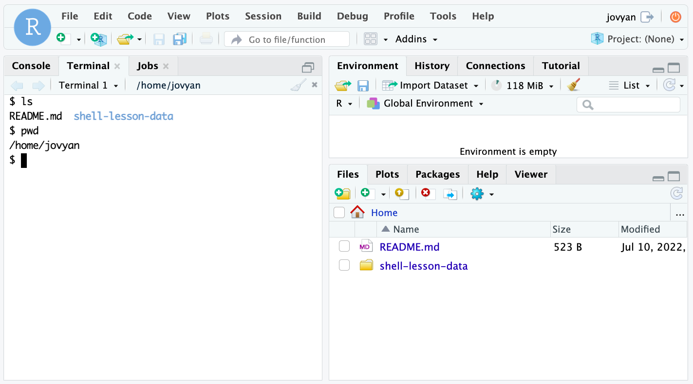

# 2022-07-13-upr-online

This branch holds the data for the UNIX portion of the [July 13 Software Carpentry Workshop](http://www.raynamharris.com/2022-07-13-upr-online/). It also has an environment file for building a binder, or executable notebook, in a web brower if you need a remote terminal.

